# COVID-19 Forecasting

## Afghanistan

## Albania

## Algeria

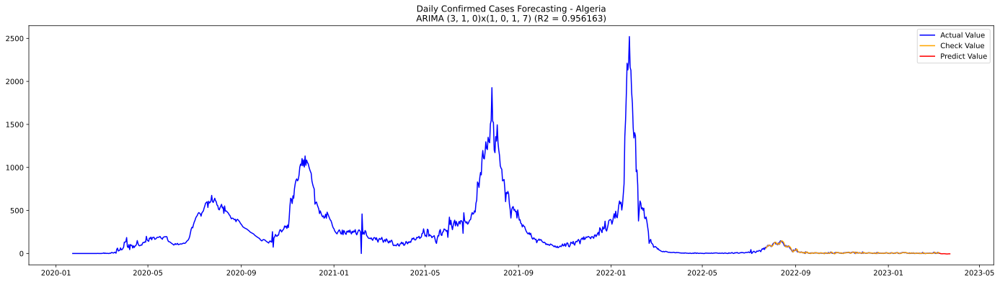

## Andorra

## Angola

## Antarctica

## Antigua and Barbuda

## Argentina

## Armenia

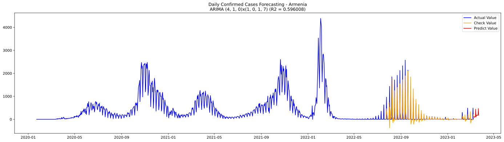

## Australia

## Austria

## Azerbaijan

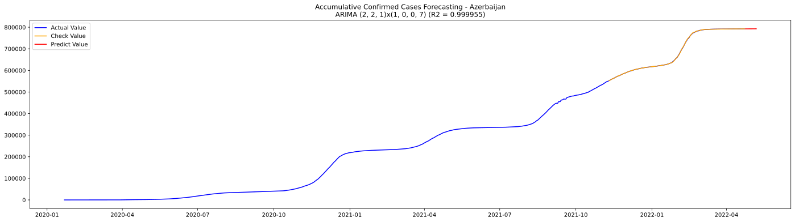

## Bahamas

## Bahrain

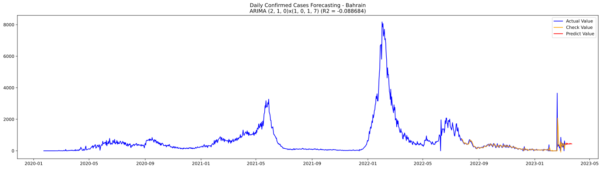

## Bangladesh

## Barbados

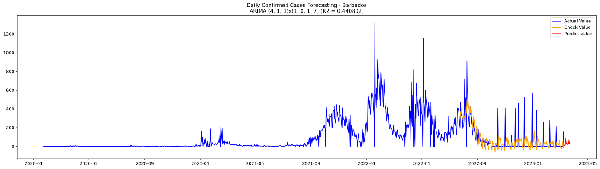

## Belarus

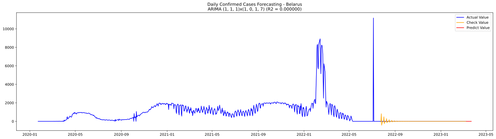

## Belgium

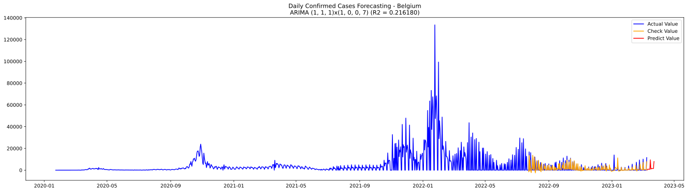

## Belize

## Benin

## Bhutan

## Bolivia

## Bosnia and Herzegovina

## Botswana

## Brazil

## Brunei

## Bulgaria

## Burkina Faso

## Burma

## Burundi

## Cabo Verde

## Cambodia

## Cameroon

## Canada

## Central African Republic

## Chad

## Chile

## China

## Colombia

## Comoros

## Congo (Brazzaville)

## Congo (Kinshasa)

## Costa Rica

## Cote d'Ivoire

## Croatia

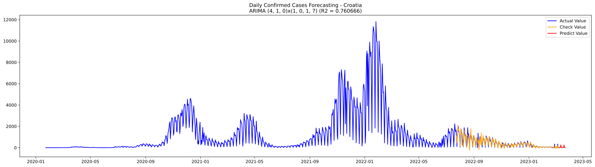

## Cuba

## Cyprus

## Czechia

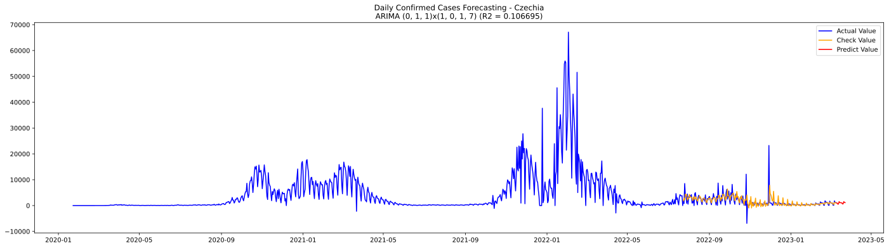

## Denmark

## Diamond Princess

## Djibouti

## Dominica

## Dominican Republic

## Ecuador

## Egypt

## El Salvador

## Equatorial Guinea

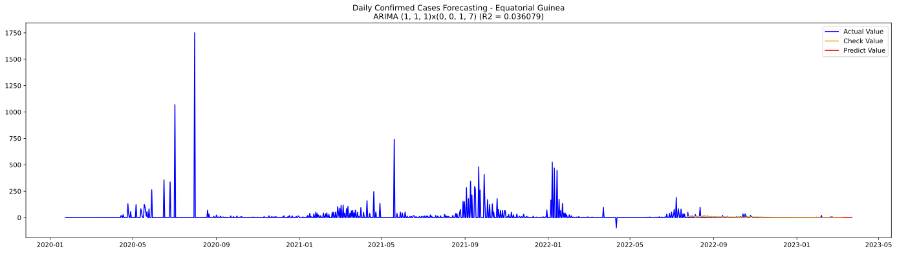

## Eritrea

## Estonia

## Eswatini

## Ethiopia

## Fiji

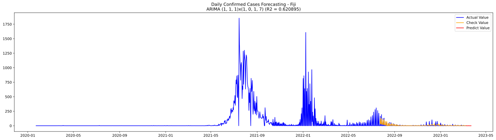

## Finland

## France

## Gabon

## Gambia

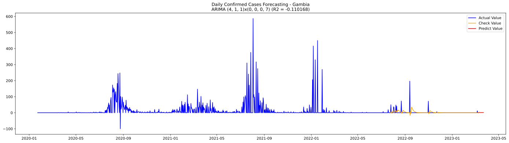

## Georgia

## Germany

## Ghana

## Greece

## Grenada

## Guatemala

## Guinea

## Guinea-Bissau

## Guyana

## Haiti

## Holy See

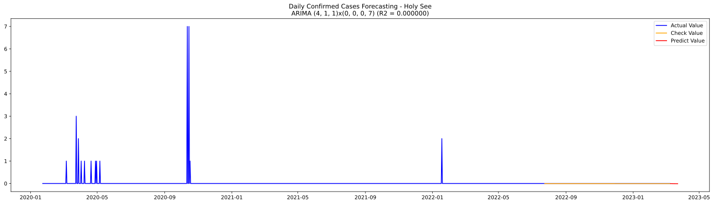

## Honduras

## Hungary

## Iceland

## India

## Indonesia

## Iran

## Iraq

## Ireland

## Israel

## Italy

## Jamaica

## Japan

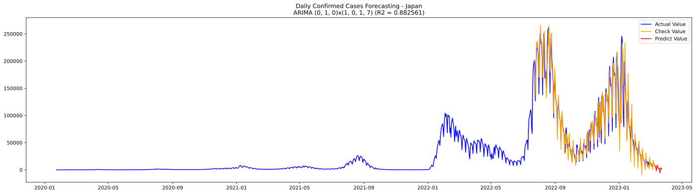

## Jordan

## Kazakhstan

## Kenya

## Kiribati

## Korea, South

## Kosovo

## Kuwait

## Kyrgyzstan

## Laos

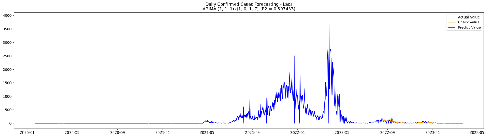

## Latvia

## Lebanon

## Lesotho

## Liberia

## Libya

## Liechtenstein

## Lithuania

## Luxembourg

## MS Zaandam

## Madagascar

## Malawi

## Malaysia

## Maldives

## Mali

## Malta

## Marshall Islands

## Mauritania

## Mauritius

## Mexico

## Micronesia

## Moldova

## Monaco

## Mongolia

## Montenegro

## Morocco

## Mozambique

## Namibia

## Nepal

## Netherlands

## New Zealand

## Nicaragua

## Niger

## Nigeria

## North Macedonia

## Norway

## Oman

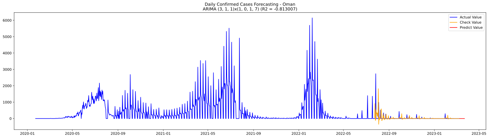

## Pakistan

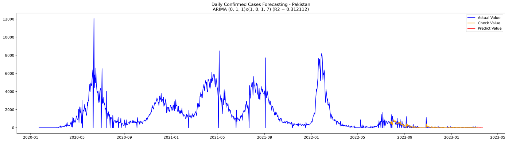

## Palau

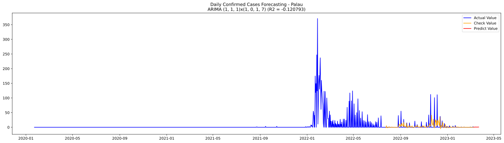

## Panama

## Papua New Guinea

## Paraguay

## Peru

## Philippines

## Poland

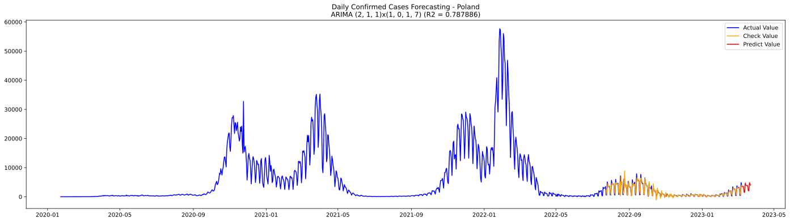

## Portugal

## Qatar

## Romania

## Russia

## Rwanda

## Saint Kitts and Nevis

## Saint Lucia

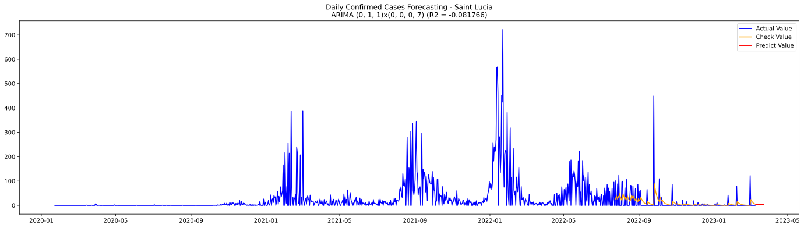

## Saint Vincent and the Grenadines

## Samoa

## San Marino

## Sao Tome and Principe

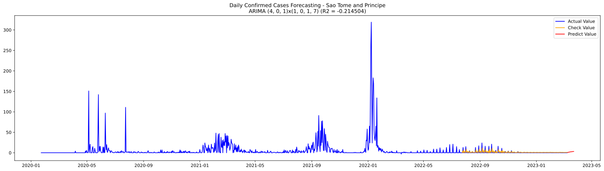

## Saudi Arabia

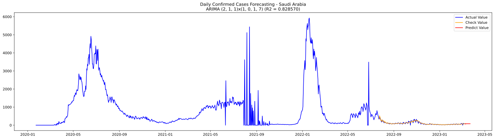

## Senegal

## Serbia

## Seychelles

## Sierra Leone

## Singapore

## Slovakia

## Slovenia

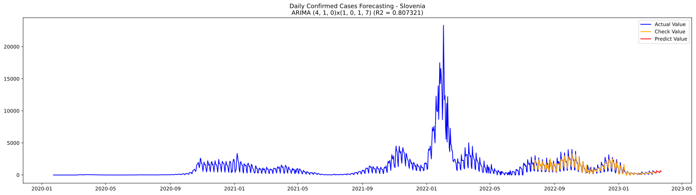

## Solomon Islands

## Somalia

## South Africa

## South Sudan

## Spain

## Sri Lanka

## Sudan

## Summer Olympics 2020

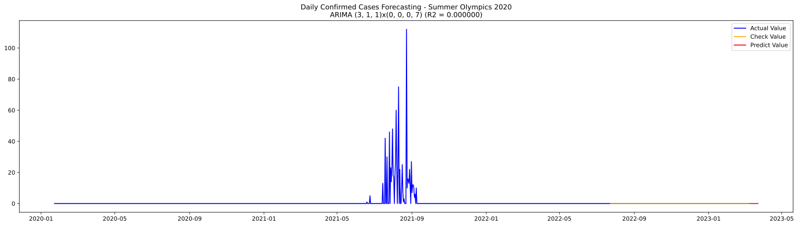

## Suriname

## Sweden

## Switzerland

## Syria

## Taiwan*

## Tajikistan

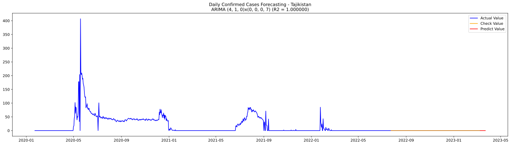

## Tanzania

## Thailand

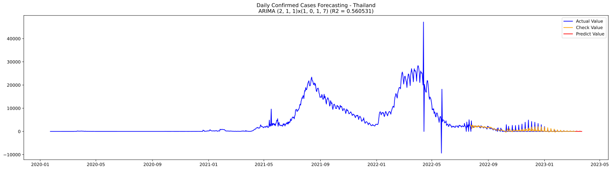

## Timor-Leste

## Togo

## Tonga

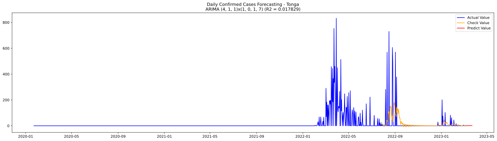

## Trinidad and Tobago

## Tunisia

## Turkey

## US

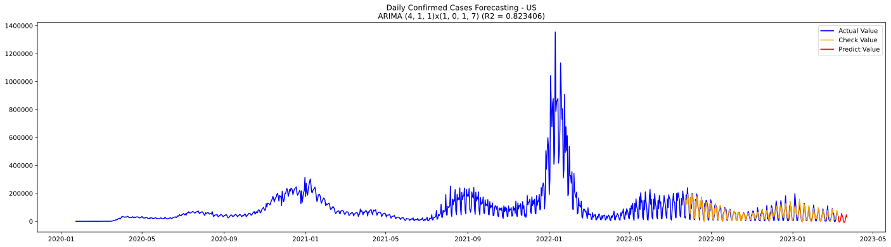

## Uganda

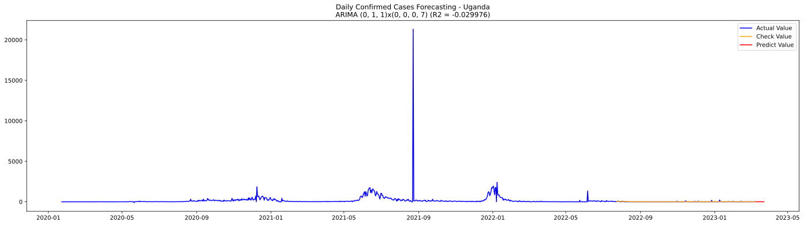

## Ukraine

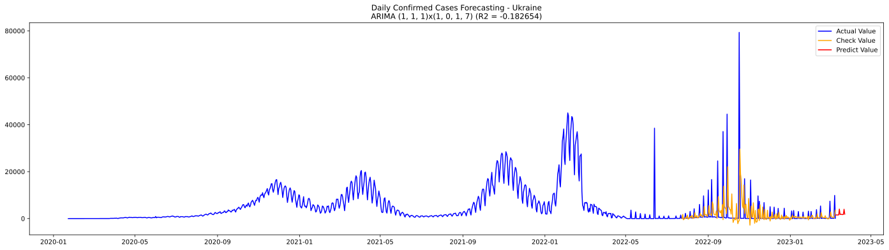

## United Arab Emirates

## United Kingdom

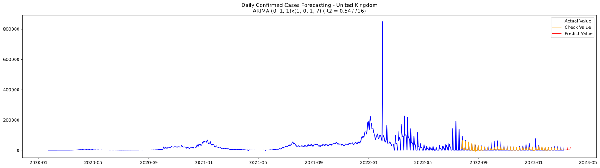

## Uruguay

## Uzbekistan

## Vanuatu

## Venezuela

## Vietnam

## West Bank and Gaza

## Winter Olympics 2022

## Yemen

## Zambia

## Zimbabwe

