# COVID-19 Forecasting

## 安徽

## 北京

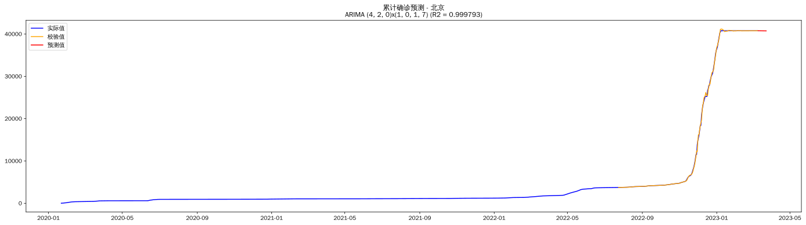

## 重庆

## 福建

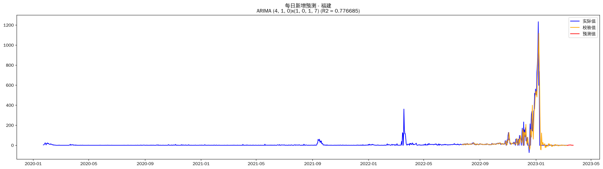

## 甘肃

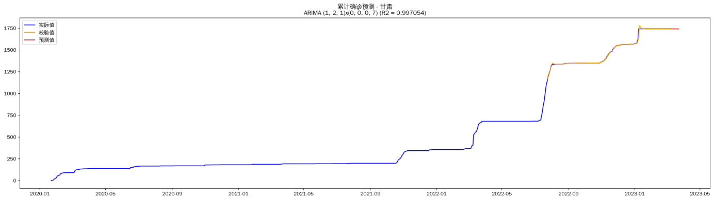

## 广东

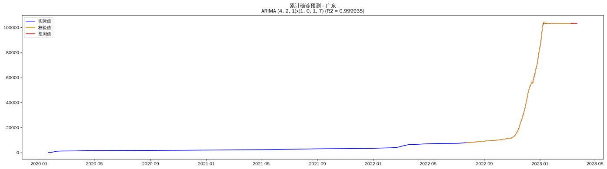

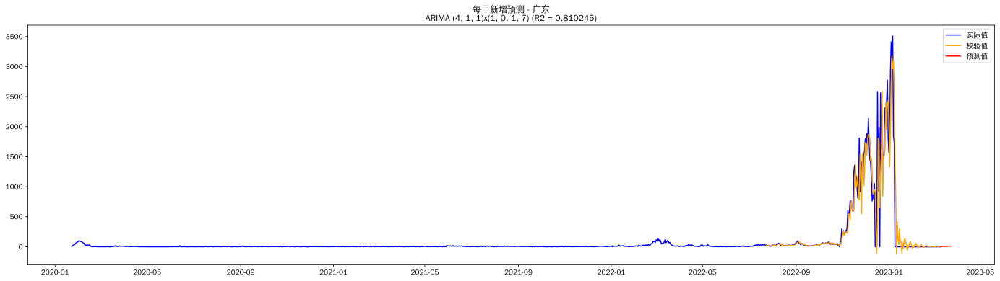

## 广西

## 贵州

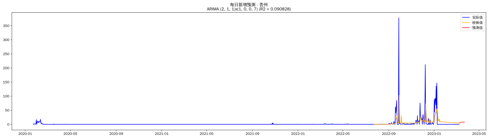

## 海南

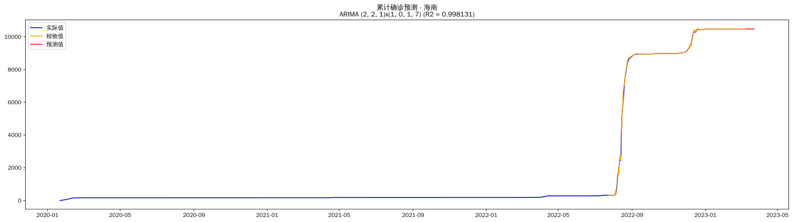

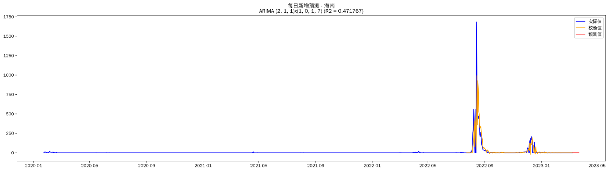

## 河北

## 黑龙江

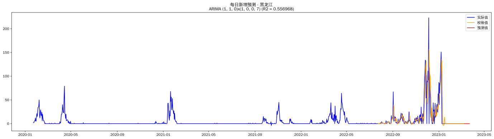

## 河南

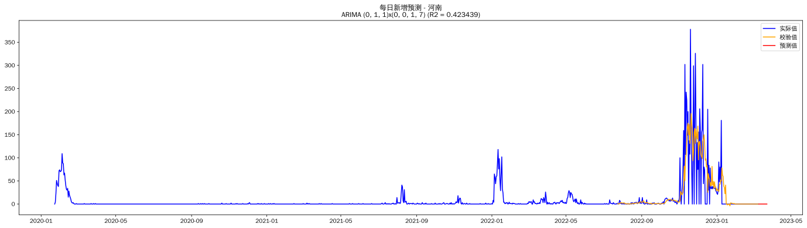

## 香港

## 湖北

## 湖南

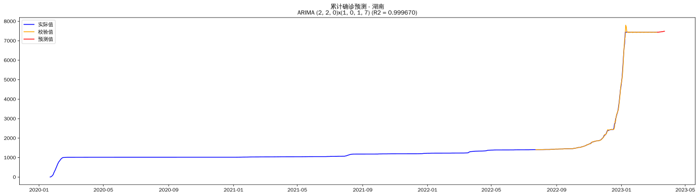

## 内蒙古

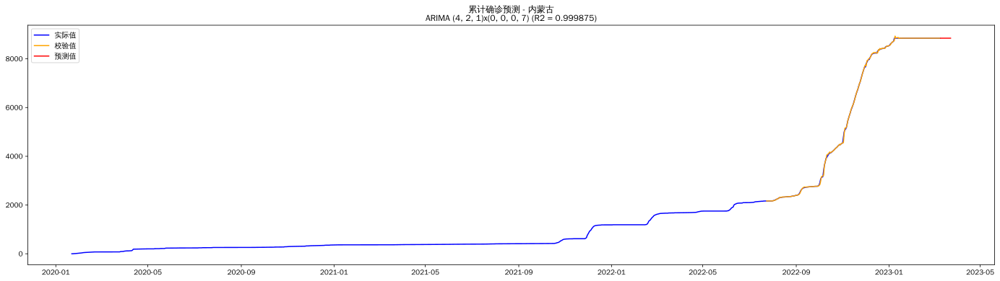

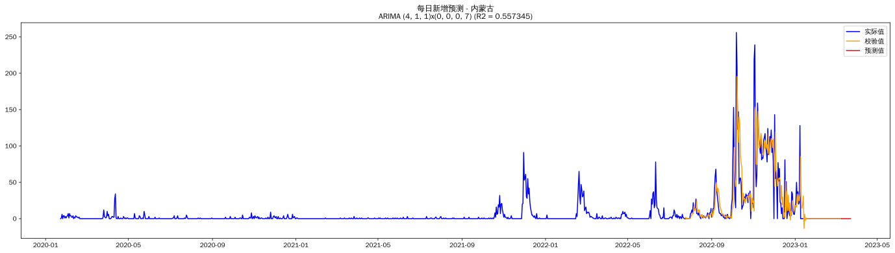

## 江苏

## 江西

## 吉林

## 辽宁

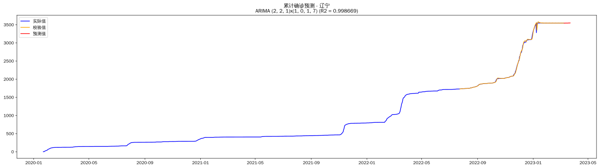

## 澳门

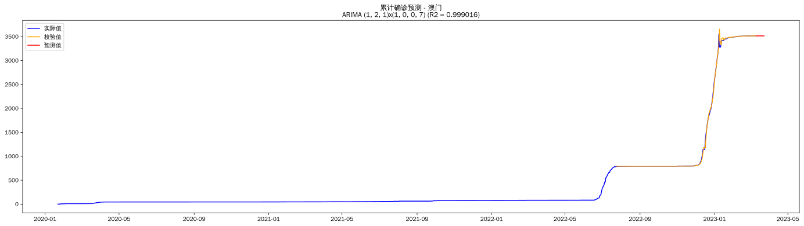

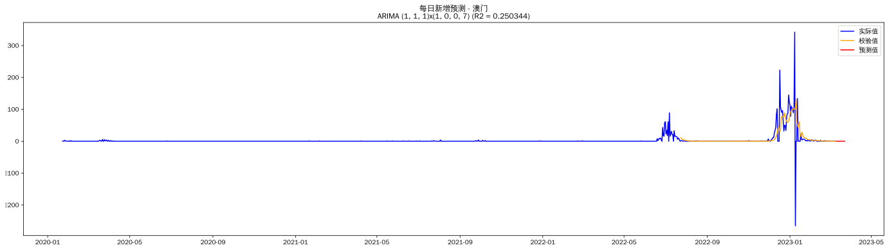

## 宁夏

## 青海

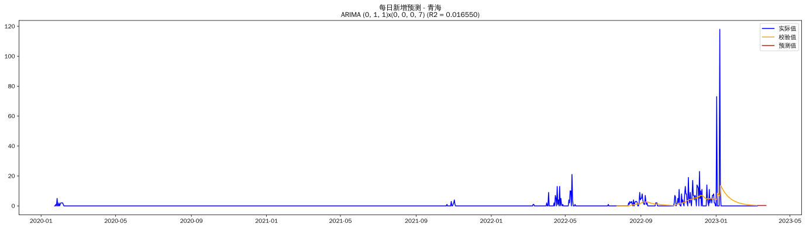

## 陕西

## 山东

## 上海

## 山西

## 四川

## 台湾

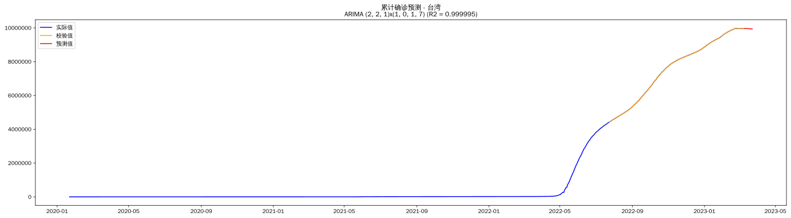

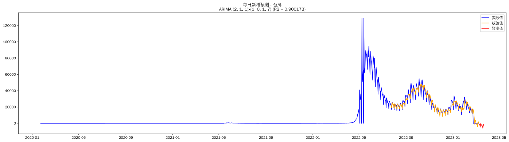

## 天津

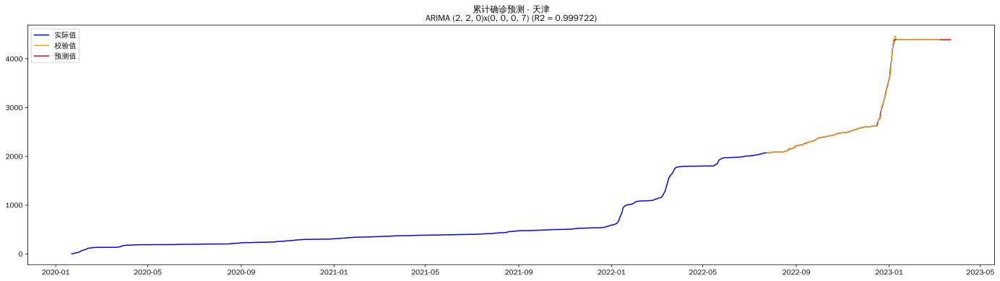

## 西藏

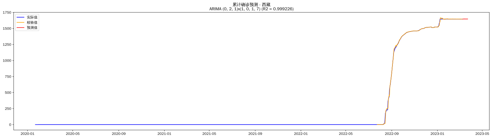

## 新疆

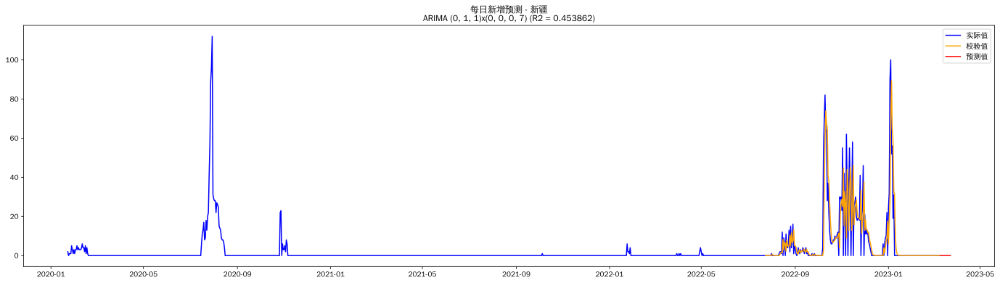

## 云南

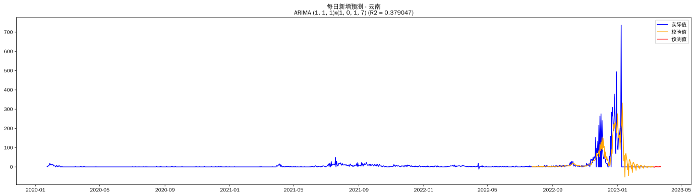

## 浙江

